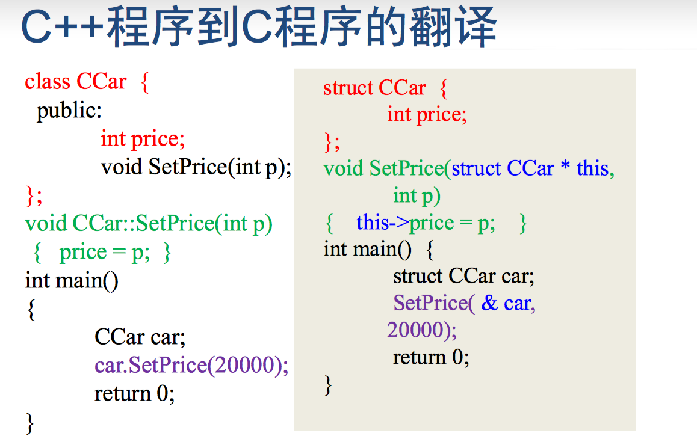

### this指针

<center>

</center>

* 非静态成员函数中可以直接使用this来代表指向该函数作用的对象的指针

```
class Complex {
public:
    double real, imag;

    void Print() { cout << real << "," << imag; }

    Complex(double r, double i) : real(r), imag(i) {
    }

    Complex AddOne() {
        this->real++;  // 等价于real ++;
        this->Print(); // 等价于 Print
        return *this;
    }
};

int main() {
    Complex c1(1,1),c2(0,0);
    c2 = c1.AddOne();
    return 0;
} //输出 2,1
```

区分：

```
class A
{
    int i;
public:
    void Hello() {
        cout << "hello" << endl;
    }

    void Hello_i() {
        cout << i << " hello" << endl;
    }
};

// <=> void Hello(A * this ) { cout << "hello" << endl; }


int main()
{
    A * p = NULL;
    p->Hello();  // 等价于Hello(p)，输出：hello
    p->Hello_i(); //等价于Hello(p)，出错

} 
```

* 静态成员函数中不能使用 this 指针！因为静态成员函数并不具体作用与某个对象!因此，静态成员函数的真实的参数的个数，就是程 序中写出的参数个数！