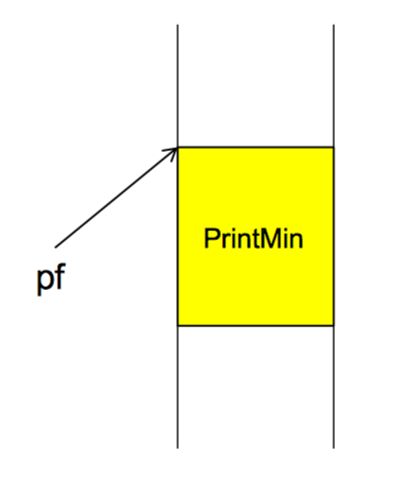
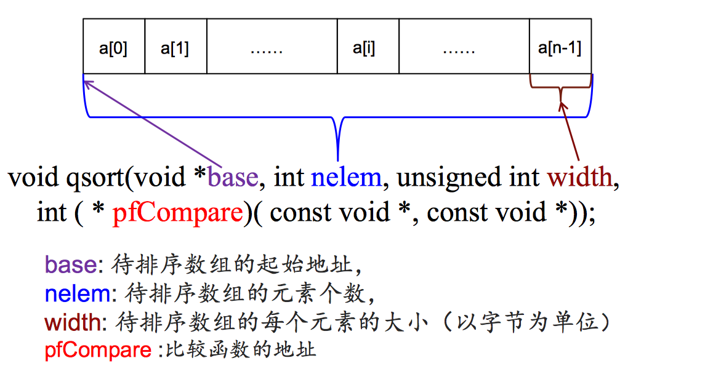

### 函数指针 function pointer

***

1. 函数名为该函数所占内存区域的起始地址（也称为“入口地址”）。可以将函数的入口地址赋值给一个指针变量，使该指针变量指向该函数。然后通过指针变量就可以调用这个函数。这种指向函数的指针变量成为“<font color="red">函数指针</font>”。

    函数指针定义形式：类型名 (* 指针变量名)(参数类型1, 参数类型2,…);
<center>

</center>

```
//函数指针使用
#include <stdio.h>
void PrintMin(int a, int b)
{
	if(a<b)
	    printf("%d", a);
	else
	    printf("%d", b);
}

int main()
{
	void (*pf)(int, int);
	int x = 4, y=5;
	pf = PrintMin;
	pf(x, y);
	return 0;
}
```
***

* 2、qsort快速排序(c语言)

<!--  -->
<center>

</center>

```
// 快速排序函数
void qsort(void *base, int nelem,unsigned int width, int (* pfCompare)(const void *, const void *))
```
```
// 自己编写比较函数
// pfCompare(e1, e2)
/* int 比较函数名(const void *elem1, const void *elem2)
* 如果 *elem1应该排在 *elem2 前面，返回值应该为负整数
* 如果 *elem1 和 *elem2 哪个排在前面都行，返回值应该为0
* 如果 *elem1应该排在 *elem2 后面，返回值应该为正整数
*/
```
```
#include <stdio.h>
#include <stdlib.h>

int MyCompare(const void *elem1, const void *elem2)
{
    unsigned int *p1, *p2;
    p1 = (unsigned int *)elem1;
    p2 = (unsigned int *)elem2;
    return (*p1 % 10) - (*p2 % 10);
}

#define NUM 5
int main() {
    unsigned int a[NUM] = {8, 123, 11, 10, 4};
    qsort(a, 5, 4, MyCompare);
    for(int i=0; i<NUM; i++)
    {
        printf("%d ", a[i]);
    }
    return 0;
}
```
