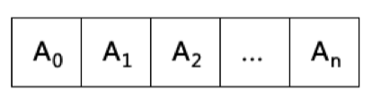
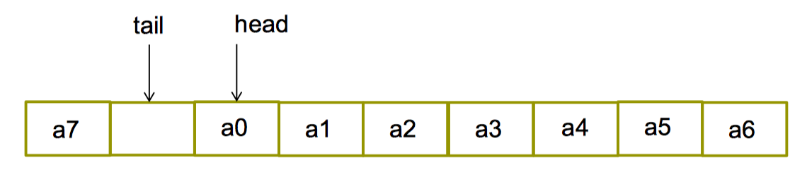
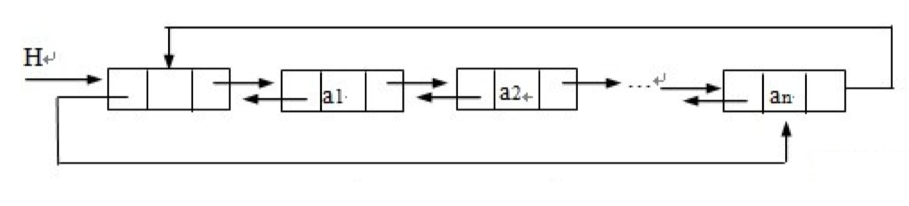
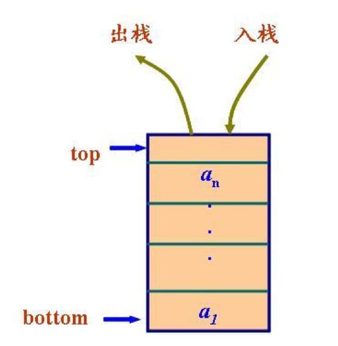
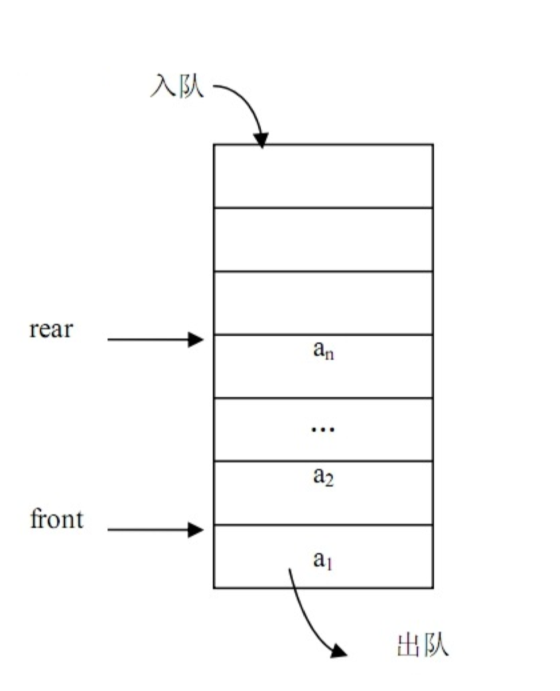

### 容器

---

对象插入容器中时，被插入的是对象的一个复制品。许多算法，比如排序，查找，要求对容器中的元素进行比较，有的容器本身就是排序的，所以放入容器的对象所属的类，往往还应该重载 == 和 < 运算符。

**1. 顺序容器**  
容器并非排序的，元素插入的位置同元素的值无关。

* **vector**  
头文件 <vector\>  
动态数组。元素在内存中连续存放。随机存取任何元素都能在常数时间完成。在尾端增删元素具有较佳的性能（大部分情况下为常数时间）。

<center>

</center>

```
#include <iostream>
#include <vector>
#include <algorithms>
using namespace std;

int main() {
    int i;
    int a[5] = {1,2,3,4,5};
    vector<int> v(5);
    cout << v.end() - v.begin() << endl;
    for( i = 0; i < v.size(); i ++ )
        v[i] = i;
    v.at(4) = 100;
    for( i = 0; i < v.size(); i ++ )
        cout << v[i] << "," ;
    cout << endl;
    vector<int>::iterator it;
    // typename vector<int>::const_iterator it; //typename可加可不加
    for(it = v.begin(); it != v.end(); it++)
    {
        cout << *it << " ";
    }
    cout << endl;
    vector<int> v2(a,a+5); //构造函数
    v2.insert(v2.begin() + 2,13); //在begin()+2位置插入13
    for( i = 0; i < v2.size(); i ++ )
        cout << v2.at(i) << "," ;

    sort(v.begin(), v.end());  //对vector进行排序
    sort(a, a+5); //对数组进行排序
}
/* 输出：
5
0,1,2,3,100,
1,2,13,3,4,5,
*/
```

* **dequeue 双向队列**  
头文件 <dequeue\>  
双向队列。元素在内存中里连续存放。随机存取任何元素都能在常数时间完成（但次于vector）。在两端增删元素具有较佳的性能（大部分情况是常数时间）。

<center>
	
</center>

* **list**  
头文件 `<list>`  
双向链表。元素在内存不连续存放。在任何位置增删元素都在常数时间完成。不支持随机存取。  
<center>
	
</center>
-> 与其他顺序容器不同, list容器只能使用双向迭代器  
-> 因此迭代器不支持大于/小于比较运算符, []运算符和随机移动  
-> <font color="red"> typename用来说明 list<T>::const_  iterator是个类型  </font>

list支持的成员函数：

成员函数 | 作用
- | -  
push_front() | 在链表最前面插入
pop_front() | 删除链表最前面的元素
push_back() | 在链表最后面插入
pop_back() | 删除链表最后一个元素
sort() | 排序(list 不支持 STL 的算法 sort)
remove() | 删除和指定值相等的所有元素(类内需要重载运算符==，用于判断元素是否相等)
unique() | 删除所有和前一个元素相同的元素(类内需要重载运算符==，用于判断元素是否相等)
merge() | 合并两个链表, 并清空被合并的链表
reverse() | 颠倒链表
splice() | 在指定位置前面插入另一链表中的一个或多个元素, 并在另一链表中删除被插入的元素

<font color="red">
注意：  
(a) 不能用标准库中sort函数对list进行排序，list自己的sort成员函数：  
```
list<T> classname  
classname.sort(compare); //compare函数可以自己定义  
classname.sort(); //无参数版本, 按 < 排序 ( < 需要重载)
```

(b) list容器只能使用双向迭代器不支持大于/小于比较运算符, []运算符和随机移动(即不支持类似 “list的迭代器+2” 的操作
</font>>

```
#include <iostream>
#include <list>
using namespace std;
class A{
private:
    int n;
public:
    A(int n_){ n = n_; }
    bool operator<(const A a){
        return this->n < a.n; //小于号重载为成员函数
    }
    bool operator==(const A a){
        return this->n == a.n;  //等于号重载为成员函数
    }
    friend ostream & operator<<(ostream &o, const A &a);  //流提取运算符重载为友元函数(全局函数)
};

ostream & operator<<(ostream &o, const A &a) {
    o << a.n;
    return o;
}

template <class T>
void PrintList(const list<T> &lst){
    int tmp = lst.size();
    if (tmp > 0) {
        typename list<T>::const_iterator it;
        for(it = lst.begin(); it != lst.end(); it++){
            cout << *it << " ";
        }
        cout << endl;
    }
}

int main() {
    list<A> ls;
    A a(2);
    A a_(3);
    bool flag = a < a_;
    cout << flag << endl;
    for(int i = 1; i < 5; i++)
        ls.push_back(i);
    for(int i = 1; i < 5; i++)
        ls.push_front(i);
    PrintList(ls);
    /*
    ls.sort(); //错误，小于号需要定义为A的友元函数（全局函数）。
    */
    return 0;
}
/* 输出：
1
4 3 2 1 1 2 3 4 
/*

```

**小于号重载为成员函数无法使用ls.sort()函数对list进行排序，需要定义为类的友元全局函数，如下：**

```
#include <iostream>
#include <list>
using namespace std;
class A{
private:
    int n;
public:
    A(int n_){ n = n_; }
    friend bool operator<(const A &a, const A &b);    //小于号重载为友元函数（全局）
//    friend bool operator==(const A &a, const A &b);   //等于号重载为友元函数（全局）
    friend ostream & operator<<(ostream &o, const A &a);  //流提取运算符重载为友元函数（全局）
};

bool operator<(const A &a, const A &b){
    return a.n < b.n;
}

//bool operator==(const A &a, const A &b){
//    return a.n == b.n;
//}

ostream & operator<<(ostream &o, const A &a) {
    o << a.n;
    return o;
}


template <class T>
void PrintList(const list<T> &lst){
    int tmp = lst.size();
    if (tmp > 0) {
        typename list<T>::const_iterator it;
        for(it = lst.begin(); it != lst.end(); it++){
            cout << *it << " ";
        }
        cout << endl;
    }
}

int main() {
    list<A> ls;
    A a(2);
    for(int i = 1; i < 5; i++)
        ls.push_back(i);
    for(int i = 1; i < 5; i++)
        ls.push_front(i);
    PrintList(ls);
    ls.sort();
    PrintList(ls); 
    /*
    ls.remove(2); // 错误，未定义==，无法判断并且删除相等的元素
    ls.unique();  //错误，未定义==，无法判断并且删除相等的元素
    */
    return 0;
}

/* 输出：
4 3 2 1 1 2 3 4 
1 1 2 2 3 3 4 4 
*/
```

```
#include <iostream>
#include <list>
using namespace std;
class A{
private:
    int n;
public:
    A(int n_){ n = n_; }
    friend bool operator<(const A &a, const A &b);    //小于号重载为友元函数（全局）
    friend bool operator==(const A &a, const A &b);   //等于号重载为友元函数（全局），用于判定元素是否相等
    friend ostream & operator<<(ostream &o, const A &a);  //流提取运算符重载为友元函数（全局）
};

bool operator<(const A &a, const A &b){
    return a.n < b.n;
}

bool operator==(const A &a, const A &b){
    return a.n == b.n;
}

ostream & operator<<(ostream &o, const A &a) {
    o << a.n;
    return o;
}


template <class T>
void PrintList(const list<T> &lst){
    int tmp = lst.size();
    if (tmp > 0) {
        // 在模板函数中，typename不能少，否则报错use of undeclared identifier 'it'
        typename list<T>::const_iterator it;
        for(it = lst.begin(); it != lst.end(); it++){
            cout << *it << " ";
        }
        cout << endl;
    }
}

int main() {
    list<A> ls;
    list<A> ls_;
    for(int i = 1; i < 5; i++)
        ls.push_back(i);
    for(int i = 1; i < 5; i++)
    {
        ls.push_front(i);
        ls_.push_front(i);
    }
    PrintList(ls);  // 4 3 2 1 1 2 3 4

    ls.sort();
    PrintList(ls); // 1 1 2 2 3 3 4 4

    ls.remove(2);
    PrintList(ls); // 1 1 3 3 4 4

    ls.unique();
    PrintList(ls); // 1 3 4

    ls.merge(ls_);
    PrintList(ls); // 1 3 4 4 3 2 1

    ls.reverse();
    PrintList(ls); //1 2 3 4 4 3 1
    return 0;
}
```

**2. 关联容器**  
-> 元素是排序的，从小到大排序  
-> 插入任何元素，都按相应的排序规则来确定其位置  
-> 在查找是有非常好的性能  
-> 通常以平衡二叉树方式实现，插入和检索时间都是O(log(N))

* **set/multiset**  
头文件 <set\>  
set中不允许出现相同元素，multiset中允许存在相同的元素。

* **map/multimap**  
头文件 <map\>
map与set的不同在于map中存放的元素有且仅有两个成员变量，一个名为first，另一个名为second，map根据first值对元素进行从小到大排序，并且可快速根据first来检索元素。  
map同multimap的不同在于是否允许相同first值得元素。

**3. 容器适配器**  

* **stack**  
头文件 <stack\>  
序列中被删除、检索和修改的项只能是最近被插入序列的项（栈顶的项）  
后进先出

<center>
	
</center>


* **queue**  
队列，插入只可以在尾部进行，删除、检索和修改只允许从头部进行。  
先进先出

<center>
	
</center>

* **priority_queue**  
优先级队列，最高优先级元素总是第一个出列。

**4. 容器成员函数** 

* **顺序容器和关联容器都有的成员函数**  
begin &nbsp;&nbsp;&nbsp;返回指向容器中第一个元素的迭代器  
end &nbsp;&nbsp;&nbsp;返回指向容器中最后一个元素后面的位置的迭代器  
rbegin &nbsp;&nbsp;&nbsp;返回指向容器中最后一个元素的迭代器  
rend &nbsp;&nbsp;&nbsp;返回指向容器中第一个元素前面的位置的迭代器  
erase &nbsp;&nbsp;&nbsp;从容器中删除一个或几个元素  
clear &nbsp;&nbsp;&nbsp;从容器中删除所有元素  

* **顺序容器常用的成员函数**  
front &nbsp;&nbsp;&nbsp;返回容器中第一个元素的引用  
back &nbsp;&nbsp;&nbsp;返回容器中最后一个元素的引用  
push_back &nbsp;&nbsp;&nbsp;在容器末尾增加新元素  
pop_back &nbsp;&nbsp;&nbsp;删除容器末尾的元素  
erase &nbsp;&nbsp;&nbsp;删除迭代器指向的元素（可能会使该迭代器失效），或删除一个区间，返回被删除元素后面的那个元素的迭代器  


**5. 迭代器**  
-> 指向顺序容器和关联容器中的元素  
-> 迭代器用法和指针类似  
-> 有const和非const两种  
-> 通过迭代器可以读取它指向的元素  
-> 通过非const迭代器还能修改其指向其指向的元素  

**迭代器定义**  
容器类名::iterator 变量名  
容器类名::const_iterator 变量名  
**迭代器访问**  
* 迭代器变量名

```
#include <iostream>
#include <vector>
using namespace std;

int main() {
    vector<int> v; //一个存放int元素的数组，一开始里面没有元素
    for(int i = 0; i < 5; i++)
        v.push_back(i);
    vector<int>::const_iterator it;
    for(it = v.begin(); it != v.end(); it++)
        cout << *it << " ";
    cout << endl;

    vector<int>::reverse_iterator reit //反向迭代器
    for(reit = v.rbegin(); reit != v.rend(); reit++)
        cout << *reit << " ";
    cout << endl;
    return 0;
}
```

容器 | 容器上的迭代器类别
- | -  
vector | 随机访问
dequeue | 随机访问
list | 双向
set/multiset | 双向
map/multimap | 双向
stack | 不支持
queue | 不支持
priority_queue | 不支持

* 有的算法，例如sort，binary_search需要通过随机访问迭代器来访问容器中的元素，那么 list以及关联容器就不支持该算法！
* 双向迭代器不支持大于号和小于号比较（ > 和 <）,list没有 [] 成员函数(随机访问)
